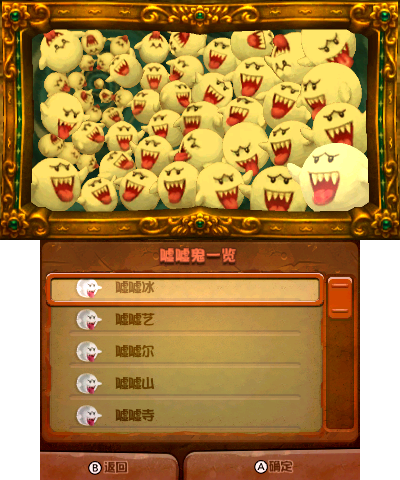

| 中文 | 日文 | 英文 | 地点 | 对话 |
| --- | --- | --- | --- | --- |
| 嘘嘘冰 | テレビン | PeekaBoo  | 休息室 | 呵呵呵，你发现了嘘嘘冰！ |
| 嘘嘘艺 | テレワン | GumBoo  | 隐藏房间 | 呀呼！我是嘘嘘艺！ |
| 嘘嘘尔 | テレッツ | Booigi  | 占卜房间 | 我是嘘嘘尔！叭哔！ |
| 嘘嘘山 | テレスリー | Kung Boo  | 镜之房间 | 叭！我是嘘嘘山！ |
| 嘘嘘寺 | テレフォー | Boogie  | 洗衣房 | 当当。我是嘘嘘寺！ |
| 嘘嘘武 | テレゴ | Boolldog  | 厨房 | 嗨乎！我是嘘嘘武！ |
| 嘘嘘陆 | テレロ | Boodacious  | 餐厅 | 咚咙！俺是嘘嘘陆！ |
| 嘘嘘气 | テレシチ | Boo La La  | 舞厅 | 咚沙！老夫是嘘嘘气！ |
| 嘘嘘巴 | テレッパ | Boohoo  | 娱乐室 | 我是嘘嘘巴！啊哈！ |
| 嘘嘘久 | テレク | ShamBoo  | 放映室 | 哎哟！我是嘘嘘久！ |
| 嘘嘘食 | テレジュ | GameBoo  | 仓库 | 哦哦哦！我是嘘嘘食！ |
| 嘘嘘林 | テレリン | Boomeo  | 音乐室 | 人家是嘘嘘林啦！ |
| 嘘嘘鲁 | テレテル | Booregard  | 健身房 | 我叫做嘘嘘鲁呢！ |
| 嘘嘘罗 | テレタロー | TurBoo  | 婴儿房间 | 嘘嘘罗参上！ |
| 嘘嘘绪 | テレミオ | Booris  | 儿童房间 | 嘻嘻…我是嘘嘘绪。 |
| 嘘嘘孙 | テレスン | Boolivia  | 访客室 | 人家是嘘嘘孙。终于遇到你了呢！ |
| 嘘嘘可 | テレピコ | Boonita  | 访客卧室 | 我是嘘嘘可…那么，再见…… |
| 嘘嘘波 | テレボ | Boolicious  | 父母卧室 | 我是嘘嘘波。那么要上了啊！ |
| 嘘嘘吉 | テレジー | TaBoo  | 书房 | 俺叫嘘嘘吉。要记住我啊！ |
| 嘘嘘恩 | テレン | BamBoo  | 客厅 | 我是害羞的嘘嘘恩！ |
| 嘘嘘泊 | テレポポ | GameBoo Advance  | 衣物室 | 我是嘘嘘泊！ |
| 嘘嘘塔 | テレッタ | Bootha  | 休息室 | 我是嘘嘘塔。先行告辞了！ |
| 嘘嘘夏 | テレシャ | Boonswoggle  | 回忆房间 | 人家是嘘嘘夏。你好啊，哈哈哈！ |
| 嘘嘘由 | テレヨ | LimBooger  | 祖父母的房间 | 你好，人家是嘘嘘由！ |
| 嘘嘘普 | テレプス | Mr. Boojangles  | 茶室 | 我、我是嘘嘘普。你、你好。 |
| 嘘嘘贝 | テレベー | UnderBoo  | 盔甲房间 | 嘘嘘贝参上！ |
| 嘘嘘杂 | テレワーザ | Boomerang  | 电话房间 | 让我嘘嘘杂教你说谚语。 |
| 嘘嘘皮 | テレロペ | Little Boo Peep  | 展示房间 | 人家是嘘嘘皮。要一决胜负吗？ |
| 嘘嘘求 | テレチュル | TamBoorine  | 陶瓷作坊 | 人家是嘘嘘求。你能抓住我吗？ |
| 嘘嘘米 | テレミー | Booscaster  | 机关房间 | 呼哈…人家是嘘嘘米！ |
| 嘘嘘特 | テレット | Bootique  | 画室 | 我是韦驮天嘘嘘特！ |
| 嘘嘘克 | テレケーロ | Boolderdash  | 冷冻室 | 老子是嘘嘘克。 |
| 嘘嘘总 | テレーゾ | Booripedes  | 地下仓库 | 我是嘘嘘总。一决胜负吧！ |
| 嘘嘘布 | テレブー | Booffant  | 管道室 | 我是嘘嘘布！稍微等一下。 |
| 嘘嘘努 | テレーヌ | Boo B. Hatch  | 配电室 | 在下是嘘嘘努！ |