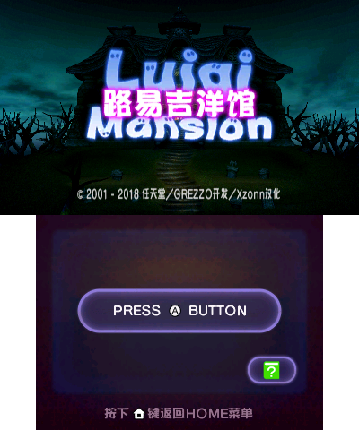
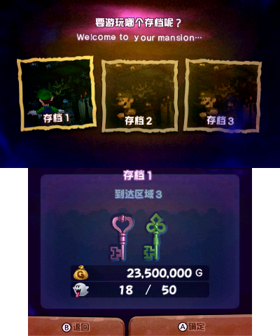
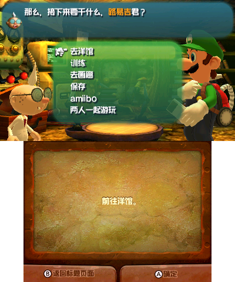
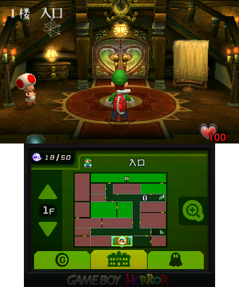

<table class="infoTable">
    <thead>
        <tr><th class="infoTableTitle" colspan="2">路易吉洋馆</th></tr>
        <tr>
            <th class="infoTableSubTitle" colspan="2">
                
ルイージマンション

                
<em>Luigi's Mansion</em>

            </th>
        </tr>
    </thead>
    <tbody>
        <tr><td class="infoTableImage" colspan="2"></td></tr>
        <tr><th>开发商</th><td>GREZZO</td></tr>
        <tr><th>发行商</th><td>任天堂</td></tr>
        <tr><th>平台</th><td>任天堂 3DS</td></tr>
        <tr><th>发售日期</th><td>2018 年 11 月 8 日</td></tr>
        <tr><th>分级</th><td>CERO：A</td></tr>
        <tr><th class="infoTableFoot" colspan="2"><a href="https://www.nintendo.co.jp/3ds/bgnj/pc/index.html">官方网站</a></th></tr>
    </tbody>
</table>

## 汉化说明
我本人从《Nintendo Direct 2018.3.9》初次公布的时候就开始关注这个游戏了，因为之前通关过《路易吉洋馆２》，感觉挺有意思。但是因为港任大概已经放弃了 3DS，因此当时就觉得这作有官方中文的可能性不大。果然，直到日本版发售后都没有官方中文的消息，因此我开始尝试自己汉化。

因为一些巧合，我发现这个游戏的文本和字库都有前辈研究过，但研究得并不完善。在经过一段时间的尝试后，我终于可以基本稳定地导出、导入文本，并修改字库了。因此，这个游戏汉化的技术问题基本已经解决，剩下的任务就是翻译了。

然而，由于我研究的是日文文本，我本人的日语水平有限，而日翻本来也比英翻数量少，因此我只能自学日语，并依靠谷歌翻译和英文文本对照，勉强把所有文本都翻译完了。因为个人能力有限，可能会有些翻译错误的地方，还请不吝赐教。

感谢任天堂和 GREZZO 开发了这么有趣的游戏，感谢神游 iQue 对《路易吉洋馆２》中文本地化作出的贡献。“哎呦·喂”、“鬼怪吸尘器”等译名均使用了神游制定的官方译名。

感谢 [IcySon55](https://github.com/IcySon55) 等人开发的 [Kuriimu](https://github.com/IcySon55/Kuriimu) 项目对本人研究文本、字库提供了思路。如果您对本作的文件格式有兴趣，可以参考 **[这篇文章](https://xzonn.github.io/Luigi-Mansion-Chinese-Localization/)**。

由于版权问题，本人汉化发布仅提供 Luma 重定向补丁。如需使用，请将压缩文件内的全部文件 **直接** 解压到 SD 卡的根目录下。同时为方便版本控制，将发布于 Github 上。发布链接：**[最新版本](https://github.com/Xzonn/LuigiMansion/releases/latest/)**。

由于没有完整测试，目前版本为预览版。如有翻译错误或死机错误，请及时反馈，反馈链接 **[在此](https://github.com/Xzonn/LuigiMansion/issues)**。

**声明：本人对游戏软件仅做研究用途，本人不提供软件本体，也从未对软件本体进行非法传播，更未对其用作商业用途。如因非法传播造成法律纠纷，概与本人无关。特此声明。**

## 汉化预览

## 游戏介绍
《**路易吉洋馆**》是 2018 年 11 月 8 日于日本发行的任天堂 3DS 游戏。该游戏是 GameCube 游戏《路易吉洋馆》的重制版，在原版的基础上加入了闪光灯、Amiibo、双人游玩等元素。其续作《**路易吉洋馆2**》（繁体：《**路易吉洋樓2**》，日文：『<strong lang="ja">ルイージマンション２</strong>』）于 2013 年发售，港台版自带简繁中文支持。

## 操作方式
* 移动：左摇杆
* 调查／开门／呼喊马力欧：<kbd>X</kbd>
* 闪光灯／跳过剧情：<kbd>A</kbd>
* 使用 Game Boy Horror 搜索：<kbd>Y</kbd>
* 切换正常移动和横向移动：<kbd>B</kbd>
* 改变路易吉的朝向：陀螺仪／C 摇杆
* 射出元素／吹气：<kbd>L</kbd>（+<kbd>A</kbd>：射出元素球）
* 使用鬼怪吸尘器：<kbd>R</kbd>
* 暂停／跳过最终战斗前的过场动画：<kbd>START</kbd>
* 触摸屏可以用来查看地图、鬼怪、收集品，或与哎呦·喂博士联系。